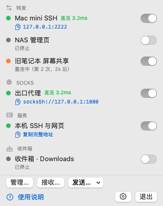
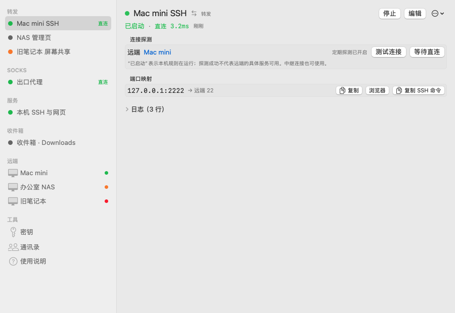

# TailCat

macOS 菜单栏工具：把 [tailcat](https://github.com/tailscale/tailcat) 的转发、服务、文件与诊断包进图形界面。Mac 既可以作为客户端连接别人，也可以作为服务端把本机端口、目录、SSH 提供出去。

<p>


</p>

截图由示例数据渲染（见 `scripts/snapshot.sh`），不含真实地址或本机路径。

## 要求

- macOS 13+（Apple 芯片或 Intel）
- 已安装 `tailcat`（推荐 `brew install tailcat`；测速和服务端端口映射需要 v0.7.0 之后的命令行，以设置中的能力检测结果为准）

## 安装

1. 从 [Releases](https://github.com/zhdsmy/TailCat/releases) 下载 `TailCat-<版本>.dmg`，打开后把 TailCat 拖进“应用程序”。
2. App 只做了 ad-hoc 签名、没有经过 Apple 公证，首次打开会被拦下：到“系统设置 › 隐私与安全性”点“仍要打开”，或执行 `xattr -dr com.apple.quarantine /Applications/TailCat.app`。
3. 可选：用同目录的 `.sha256` 校验下载，`shasum -a 256 -c TailCat-<版本>.dmg.sha256`。

从旧版本（Bundle ID 为 `app.tailcat.menubar`）升级时，规则等数据不受影响，偏好设置会自动迁移；“登录时启动”需要重新打开，并在“系统设置 › 通用 › 登录项”里删掉旧条目。

## 快速开始

菜单栏和管理窗口左侧都有“使用说明”，按连接设备、共享目录、收发文件和排查问题给出步骤。首次打开管理窗口也可直接选择“连接别人的设备 / 共享本机服务 / 接收文件”。

| 想做什么 | 操作 |
| --- | --- |
| 访问对方的网页 | 添加对方的 tc 地址或 DNS 名称为远端；远端详情的“打开网页”访问远端 80 端口。其他端口新建转发，例如 `18080:8080` 表示访问本机 18080、连接远端 8080 |
| 连接 SSH | 远端详情点“打开 SSH…”；对方需要开放 SSH 服务并完成相应授权 |
| 共享目录 | 新建服务，选择目录和权限，填写允许的客户端公钥；保存并启动后复制完整地址给对方 |
| 收发文件 | 菜单栏“接收…”选择目录并启动收件箱；发送时把文件拖到远端，或点“发送文件…”。浏览和下载需对方开放可读取的文件服务 |

客户端密钥的 `nodekey:` 公钥用于连接允许列表；SSH 公钥用于 SSH 登录，两者不能互换。长期分享或发布 DNS 时，创建服务端密钥应固定中继区域；保存密钥本身不保证自动选区时地址始终相同。

“已启动”表示本机规则在运行；“测试连接”只反映最近一次探测，不保证远端的具体端口可用。中继也可以正常连接，“等待直连”超时不一定表示离线。遇到问题可展开规则日志或复制诊断信息。

关闭管理窗口后规则继续运行；从菜单选择“退出”会停止由 TailCat 启动的规则。地址默认打码，复制按钮会复制完整值并短暂显示“已复制”。

## 构建

```bash
./scripts/bundle.sh                  # build/TailCat.app
open build/TailCat.app
UNIVERSAL=1 ./scripts/make-dmg.sh    # build/TailCat-<版本>.dmg（arm64 + x86_64）与 .sha256
```

或开发模式：

```bash
swift build
swift build --product TailCatPackageTests && swift test --skip-build
.build/debug/TailCat
```

只装了 Command Line Tools 时，`swift test` 需要先单独构建测试产物（上面第二行）；装了 Xcode 可直接 `swift test`。

检查界面效果：

```bash
./scripts/snapshot.sh            # 用示例数据渲染各页面到 build/snapshots/（--dark 为深色）
swift scripts/capture-windows.swift   # 截取正在运行的 TailCat 可见窗口到 build/captures/
```

`snapshot.sh` 只在 debug 构建里可用（`TailCat --snapshot <目录>`），数据全部在临时目录、tailcat 是假脚本，不碰真实规则或登录项设置，也不需要任何权限。快照覆盖正常、空白、失败状态，以及窄窗口、长名称、文件传输和测速结果；可滚动页面自动追加 `-scroll-N` 截图。使用 `./scripts/snapshot.sh --only=audit-` 可只渲染布局检查场景，深色加 `--dark`（放在第一个参数）。

快照不含窗口标题栏/工具栏、系统弹窗及交互测试；未聚焦窗口里的开关显示为灰色。`capture-windows.swift` 截的是真实界面（含标题栏），需要给运行它的 App（终端或 Cursor）开“屏幕录制”权限；菜单栏面板在切换到别的 App 时会自动收起，所以通常只能截到管理窗口和设置窗口。

App 为 ad-hoc 签名、仅菜单栏（`LSUIElement`），没有 Dock 图标；App 图标（通知、Finder、登录项里可见）由 `swift scripts/make-icon.swift` 用矢量绘制生成 `Resources/AppIcon.icns`，改图后重新运行即可。

## 功能概览

菜单栏按“转发 / SOCKS / 服务 / 收件箱”分组显示所有规则，可一键开关、复制本地端口或服务地址；管理窗口左侧另有“远端”“密钥”“通讯录”“使用说明”。

规则新增、编辑、删除均在保存成功后生效；失败时保留原规则和运行状态，编辑窗口显示错误并允许重试。详情页的“…”菜单可“复制为新规则”，副本默认关闭“App 启动时自动开启”，保存前可调整端口避免冲突。

### 客户端

- **网页快捷入口**：远端详情点“打开网页”，自动建立并启动本地随机端口到远端 80 的转发；重复点击复用同一规则，已运行时直接打开页面。转发仍可在规则列表中停止、编辑或删除。
- **命令导入**：支持带引号和转义的 `tailcat forward` 命令（包括含空格的 key 路径），保留客户端 key、监听地址和自动打开浏览器选项；按地址与 key 一起匹配已保存的远端。变量展开、命令替换、管道等 shell 语法、无效映射和不能导入的选项会明确报错；自定义 `--derpmap-url` 需先在设置里配置后再移除该参数导入。自动打开浏览器只允许一条映射。
- **文件复制选项**：远端文件区域可勾选“保留修改时间和权限”（`cp -p`），对该页面发起的上传和下载生效，默认关闭；菜单发送与侧栏拖放使用默认选项。

- **远端地址簿**：每个远端保存 tc 地址（或 DNS 名）、客户端 key、SSH 用户名；转发与 SOCKS 规则引用远端，地址只存一处。保存或删除失败时保留原数据、显示错误，可重试；保存失败不会关闭编辑窗口。旧版内联在规则里的地址会在启动时自动迁移为远端。
- **转发（`forward`）**：端口映射、监听地址、`--open-browser`；断线自动重启（指数退避）、唤醒/网络变化后重连、定时 `ping` 健康检查。详情页显示直连/中继与延迟，可“测试连接”“等待直连”，listener 可一键复制、在浏览器打开或复制 `ssh -p` 命令。
- **SOCKS（`socks`）**：常驻代理，可指定出口远端；显示 `socks5h://` 地址并可复制 `export all_proxy=…`。浏览器会把主机名转成小写，只能经出口远端或访问 `server.tailcat`。
- **远端详情**：显示实际使用的客户端 key（没有 `client-default` 时 tailcat 每次用临时公钥，对方无法用 `--allow` 放行，这时会提示并可一键去创建）；打开时自动 `ping`（结果超过 5 分钟才重测），侧边栏用圆点显示直连（绿）/ 中继（橙）/ 无响应（红）；规则的健康检查结果也会更新所属远端的状态。可手动“测试连接”或 `--until-direct` 等待直连；“在终端中打开” SSH（生成一次性的 `.command` 脚本，运行后自删，无需 Apple Events 权限）；文件浏览（`ls -l`，可进入目录、下载；`ls` 不带 SSH 公钥，需对方开 files 或 no-auth-ssh）与发送（`cp`，选择文件或拖入）；`perf` 测速（TCP/UDP、上传/下载/双向、并发、时长/字节数、码率、`--via-derp`），结果含吞吐曲线、UDP 丢包/抖动和负载下 RTT。
- 也可以把文件拖到侧边栏的远端上，或在菜单栏“发送…”直接发文件，结果以通知告知。

### 服务端

- **服务（`serve`）**：端口 / 范围 / 映射（`8080:80`、`5555:192.168.1.10:5555`；映射需要 v0.7.0 之后的 tailcat，检测为不支持时保存会提示）、`ssh`（授权公钥：文件、公钥行或 `用户名@github`；不能与 `no-auth-ssh` 同开）、`no-auth-ssh`、`exit-node`、`all`、`perf`、共享目录（`--files`，ro / rw / 投递箱 wo / wo+）、exec 命令（按参数列表保存，不经 shell）、`--full-address`。
- **身份**：`default` key、临时（`--key=new`）或命名 key。临时地址会在重启后变化，界面会提示。
- **安全护栏**：`no-auth-ssh`、exec、`exit-node`、`all` 未配置 `--allow` 时，保存需二次确认，并在侧边栏、菜单和详情页常驻警告；tailcat 输出的 `WARNING` 行显示为徽标。
- **地址展示**：运行后大字号显示服务地址，并给出“给对方的命令”（`tailcat forward …`、`ssh`、`ls`、`cp`、`socks`、`perf`、`ping`）。tc 地址等同于访问凭据，界面上（包括日志、错误信息和系统通知）默认打码，方便截图或共享屏幕：服务详情用一个“显示地址”按钮同时展开地址和命令，其他地方点眼睛图标；复制按钮始终复制完整值。
- **收件箱（`recv`）**：菜单栏“接收…”选目录即可；可开 `--accept-dirs`。每个新文件的大小与修改时间分别保持约 2 秒无变化后发通知，点击通知在 Finder 中定位。这是基于目录观测的判断，传输中长时间暂停仍可能触发通知。
- **在线客户端（实验性）**：设置里开启后，serve 以 `TAILCAT_STATUS_LOOP=1` 运行，详情页列出已连接客户端（按通讯录显示名字）、直连/中继和流量；输出格式变化时静默不显示。
- 唤醒/网络变化只重启客户端类规则，服务端不受影响（避免临时地址变化）。

### 密钥与通讯录

- **密钥**：列出 `genkey --list`；新建服务端 key（自动 / 现在固定最近区域 / 指定区域 / 自建 DERP 主机名，可 `--embed-derp-map`、`--psk`）或客户端 key；复制公钥（`printpub`）；删除（`default` / `client-default` 有额外提醒）。这两个会被 tailcat 隐式使用的 key 排在最前并加标记，缺失时给出一键创建。tailcat 不启动服务就无法给出已有 key 的地址，所以 App 会在创建时和 serve 启动时记录地址。
- **通讯录**：给对方的客户端公钥（`nodekey:…`）起名字，服务的“允许的客户端”按名字勾选。
- **DNS 发布向导**：生成固定区域的 key，给出 TXT 记录 `tailcat=<地址>`，并且只允许创建配置了 `--allow` 的服务；不设允许列表时只能开启 SSH（授权公钥认证），端口等其他服务会对所有读到 TXT 记录的人开放。

### 其他

- **设置**：自定义 tailcat 路径、版本与能力检测（perf、服务端端口映射）、DERP map URL、`--verbose`、系统通知、登录启动、在线客户端开关。首次启动或重新检测期间显示“检测中”，服务编辑器与 DNS 向导待检测完成后才能保存服务规则，其他规则不受影响。
- **检查更新**：设置里点“检查更新”查询 GitHub 上的最新版本；只在点击时联网，新版本需下载 DMG 替换。
- **首次使用**：找不到 tailcat 时，菜单和管理窗口会给出安装命令与“重新检测”；空白管理窗口按使用目标提供入口。端口映射、监听范围、文件权限和地址转换旁都有说明，更多示例与文件浏览排查说明按需展开。
- **诊断**：规则详情里的日志默认折叠，规则失败或重连时自动展开并显示上次退出原因；可复制等价 CLI 命令，或复制诊断信息（App/tailcat 版本、状态、最后一次 ping、最近日志；所有 tc 地址已打码）。

## 数据位置

`~/Library/Application Support/TailCat/`（目录 0700；以下文件都可能含 tc 地址等凭据，权限 0600，原子写入；无法解析的配置文件会改名为 `*.corrupt-<时间>-<唯一标识>.json` 保留，确认备份成功后才能从空列表开始）。配置文件读取失败、备份失败或版本不受支持时，原文件会保留，并阻止对该配置的保存；修复权限或恢复兼容文件后重新启动 TailCat，再继续编辑。管理窗口顶部会显示错误。

| 文件 | 说明 |
| --- | --- |
| `rules.json` | 隧道规则（v2：`kind` + 各类选项；v1 纯转发规则可直接读取） |
| `remotes.json` | 远端地址簿（地址、客户端 key、SSH 用户） |
| `contacts.json` | 通讯录（名字 → nodekey） |
| `key-meta.json` | key 的角色、地址、公钥、区域缓存（不含私钥） |
| `pids.json` | 子进程 pid、可执行文件路径与启动时间，崩溃后用于清理孤儿进程（pid 被其他进程复用时不会误杀） |

偏好设置存在 UserDefaults（domain `io.github.zhdsmy.TailCat`；`customBinaryPath`、`derpmapURL`、`verbose`、`notificationsEnabled`、`statusLoopEnabled`）。

tailcat 自身的密钥在 `~/Library/Application Support/tailcat/keys/`，App 只通过 `tailcat genkey` / `printpub` 操作，从不读取私钥文件。

## 实现要点

- 所有 tailcat 调用都以 argv 形式 exec，不经 shell；用户填写的值会被校验，不能以 `-` 开头以免被当成参数。
- `TailCatCore` 不依赖 UI，包含模型、参数构造、输出解析（listener、服务地址、SOCKS、WARNING、状态输出、`ping`、`ls -l`、`perf --json`、区域列表）与进程监管，单元测试用 `/bin/sh` 脚本模拟 tailcat。
- 子进程输出由专用线程阻塞读取：长期运行的隧道不占用 GCD 线程，短命令也不会因输出超过管道缓冲而卡住。

## 参与开发

开发规范、安全约束、提交格式、版本号规则与发布流程见 [AGENTS.md](AGENTS.md)，变更记录见 [CHANGELOG.md](CHANGELOG.md)。推送 `vX.Y.Z` tag 后，GitHub Actions 会构建 universal DMG 并发布到 Releases。

## 许可证

[MIT](LICENSE)。TailCat 是社区项目，并非 Tailscale 官方出品；tailcat 本身的许可证见其仓库。
