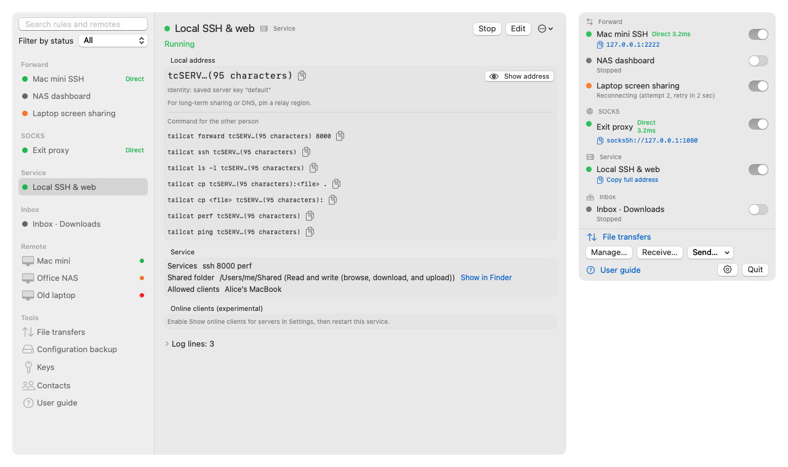
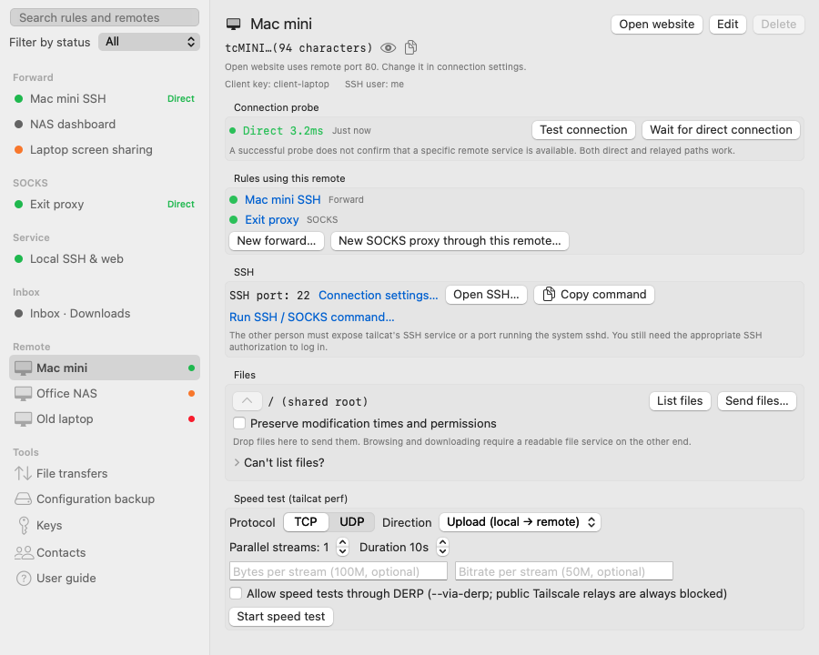

# TailCat

**English** · [简体中文](README.zh-CN.md)

A macOS menu bar app for [tailcat](https://github.com/tailscale/tailcat): manage tunnels, share services and files, and diagnose connections. Your Mac can connect to other devices or share its own ports, folders and SSH access.

<picture>
  <source media="(prefers-color-scheme: dark)" srcset="docs/screenshots/overview-en-dark.png">
  
</picture>

The management window and menu bar are shown together above. All screenshots use English UI and fictional sample data from `scripts/snapshot.sh`; images follow your light or dark theme.

Supports **English, 简体中文 and 繁體中文**. The app follows the system language by default and falls back to English for other languages. Choose an override in **Settings → Language**, then reopen TailCat to apply it.

## Requirements

- macOS 13 or later, on Apple Silicon or Intel.
- `tailcat` installed, preferably with `brew install tailcat`. Performance tests and server port mappings require a version newer than v0.7.0; check the detected capabilities in Settings.

## Installation

1. Download `TailCat-<version>.dmg` from [Releases](https://github.com/zhdsmy/TailCat/releases), open it and drag TailCat to Applications.
2. The app is ad-hoc signed and is not notarized by Apple. On first launch, use **System Settings → Privacy & Security → Open Anyway**, or run `xattr -dr com.apple.quarantine /Applications/TailCat.app`.
3. Optionally verify the download with the accompanying checksum: `shasum -a 256 -c TailCat-<version>.dmg.sha256`.

Upgrading from early builds with bundle ID `app.tailcat.menubar` preserves rules and migrates preferences. Re-enable **Launch at login** and remove the old entry from **System Settings → General → Login Items**.

## Getting started

Open **User guide** from the menu or management sidebar for connection, folder sharing, file transfer and troubleshooting instructions. The empty management window also offers shortcuts for your first task.

| Goal | Start here |
| --- | --- |
| Open another device’s website | Add its tc address or DNS name as a remote, then choose **Open website**. This forwards a random local port to the remote’s saved web port (80 by default). Change the port in connection settings; use a custom forward for multiple mappings, such as `18080:8080`. |
| Connect over SSH | Add a remote and choose **Open SSH in Terminal…**. The other device must offer SSH access. A client nodekey public key grants access through `--allow`; SSH public keys authenticate the SSH login separately. |
| Share a local folder | Create a service, choose the folder and permissions, and select allowed clients. Start it and copy the address or suggested command for the recipient. |
| Send or receive files | Choose **Receive…** in the menu to start an inbox. To send, drop files onto a remote or choose **Send files…**. Browsing and downloading require a readable file service on the other device. |

**Started** describes a local rule’s process. A connection test reports the latest probe and does not prove a particular remote port is available. Relay connections are usable; a timeout while waiting for a direct connection does not necessarily mean the remote is offline. Expand the logs or copy diagnostics when troubleshooting.

Closing the management window leaves rules running. Quitting TailCat stops the rules it started. Addresses are masked by default; copy buttons copy the complete value and briefly show confirmation.

## Building

```bash
./scripts/bundle.sh                 # build/TailCat.app
open build/TailCat.app
UNIVERSAL=1 ./scripts/make-dmg.sh   # arm64 + x86_64 DMG and .sha256
```

For development:

```bash
swift build
swift build --product TailCatPackageTests && swift test --skip-build
.build/debug/TailCat
```

With Command Line Tools alone, build the test product separately before `swift test`, as shown above. Full Xcode installations can run `swift test` directly.

To inspect the UI with sample data:

```bash
./scripts/snapshot.sh --language=en
./scripts/snapshot.sh --language=en --only=readme- # README overview and remote screenshots
./scripts/snapshot.sh --dark --language=zh-Hant
./scripts/snapshot.sh --language=zh-Hans --only=audit-
swift scripts/capture-windows.swift
```

Snapshots are available only in debug builds. They use temporary data and a fake tailcat, without accessing real rules or login-item settings. They cover normal, empty and error states, narrow windows, long names, transfers and performance reports. Scrollable pages generate additional `-scroll-N` images. Language-specific output uses `build/snapshots-<language>/` or `build/snapshots-dark-<language>/`.

Snapshots omit window chrome, system dialogs and interactive behavior. Switches can appear gray in unfocused windows. `capture-windows.swift` captures actual visible windows, including title bars, and requires Screen Recording permission for the terminal app. Menu popovers close when another app becomes active.

TailCat is a menu bar app (`LSUIElement`) with no Dock icon. Run `swift scripts/make-icon.swift` to regenerate `Resources/AppIcon.icns` after changing the icon drawing code.

## Features

The menu groups rules into forwards, SOCKS, services and inboxes, with quick toggles and address copying. The management sidebar also contains remotes, file transfers, configuration backup, keys, contacts and the usage guide. Search rules and remotes with **⌘F**, filter by status, or right-click an entry for quick actions.

Task presets cover websites, shared folders, SSH and inboxes. Port mappings support separate fields or text syntax, validation points to the affected fields, and advanced settings expand on demand. **Save and start** runs a rule after it is saved; **Save** only saves it. Both retain the existing access-control confirmation.

Changes to rules take effect only after saving succeeds. Failed saves preserve the original rule and running state, show an error and allow retrying. **Duplicate as new rule** creates an independent copy with automatic startup disabled so you can adjust ports before saving.

### Clients

Remote management brings connection checks, SSH, files and speed tests into one window.

<picture>
  <source media="(prefers-color-scheme: dark)" srcset="docs/screenshots/remote-en-dark.png">
  
</picture>

- **Website shortcut:** establishes or reuses a supervised forward from a random local port to the remote’s saved web port (80 by default). Repeated clicks reuse the same rule and open the page when ready. Edit or stop it like any other rule.
- **Command import:** accepts quoted and escaped `tailcat forward` commands, including key paths with spaces. Preserves the client key, bind address and browser option, and matches saved remotes by both address and key. Invalid mappings, unsupported options, shell expansions, substitutions and pipes are rejected. Configure a custom `--derpmap-url` in Settings before removing that option from an imported command. Opening a browser requires exactly one mapping.
- **Transfer activity:** all uploads and downloads appear in **File transfers**, including menu sends and sidebar drops. Track status and elapsed time, cancel active jobs, retry failed/cancelled jobs, or reveal downloads in Finder. Switching pages does not stop transfers; quitting cancels active jobs and clears history. The app does not estimate byte progress.
- **File ports:** `cp -P` uses each remote’s saved file port. The current `ls` wrapper lists only port 22; for a custom port, enter the path directly to upload or download.
- **Copy options:** optionally preserve timestamps and permissions with `cp -p` for uploads and downloads in the remote file browser. Menu and sidebar transfers use the default copy options.
- **Remote directory:** stores each address or DNS name, client key, SSH username and endpoint, web port and file port once. Forwards and SOCKS rules reference the remote. Save and delete errors preserve existing data and remain visible for retrying. Legacy inline rule addresses migrate automatically.
- **Port forwarding:** supports mappings, bind addresses, `--open-browser`, reconnects with exponential backoff, reconnects after wake or network changes, and periodic `ping` health checks. Copy listeners, open them in a browser or copy an SSH command.
- **SOCKS:** runs a persistent proxy, optionally through an exit remote. Copy its `socks5h://` address or an `export all_proxy=…` command. Because browsers lowercase hostnames, they must use an exit remote or `server.tailcat`.
- **Remote details:** shows the effective client key and offers to create `client-default` when it is missing. Without a saved client key, tailcat uses a temporary public key that cannot be reliably added to another device’s `--allow` list. Opening a remote probes it if the last result is over five minutes old; health checks also update its status. Status dots distinguish direct, relayed and unresponsive connections.
- **SSH and diagnostics:** manually test connections or wait for a direct path with `--until-direct`. Probe failures retain masked error details and recovery suggestions. Open SSH in Terminal using a temporary, self-deleting `.command` script without Apple Events permission. **Run SSH / SOCKS command…** executes a command remotely via SSH, or locally through a temporary proxy. Enter one argument per line; spaces and metacharacters are preserved as arguments.
- **Files and performance:** browse directories with `ls -l`, download or upload with `cp`, and send files by dragging them onto a remote. File listing does not pass SSH public keys; the remote must offer files or no-auth-ssh access. Performance tests support TCP/UDP, upload/download/both, parallel streams, time or byte limits, bitrate and `--via-derp`, with throughput charts, UDP loss/jitter and RTT under load.

### Servers

- **Services:** publish ports, ranges or mappings such as `8080:80` and `5555:192.168.1.10:5555`. Unsupported mappings are rejected before saving. Offer `ssh`, `no-auth-ssh`, `exit-node`, `all`, `perf`, shared folders (`--files`, with ro/rw/wo/wo+ modes), exec commands and `--full-address`. SSH accepts an authorized-keys file, public-key line or `username@github`, and cannot be enabled alongside no-auth-ssh. Exec arguments are stored separately and never passed through a shell.
- **Identity:** choose `default`, a named key or a temporary identity (`--key=new`). The UI explains that temporary addresses change after restarting.
- **Access controls:** saving no-auth-ssh, exec, exit-node or all-port services without `--allow` requires confirmation and keeps a warning visible. `WARNING` output from tailcat also appears as badges.
- **Address sharing:** view the service address and copy suggested forward, SSH, file, SOCKS, performance and ping commands. tc addresses act as access credentials and are masked in the UI, logs, errors and notifications. Reveal controls show them when needed; copy buttons always copy complete values.
- **Inbox:** choose a folder with **Receive…**, optionally allowing directories with `--accept-dirs`. Each new item must keep a stable size and modification time for about two seconds before a notification is sent. Clicking it reveals the file in Finder. This is a directory-observation heuristic; a long pause during a transfer can still trigger a notification.
- **Connected clients (experimental):** enables `TAILCAT_STATUS_LOOP=1` for services and shows clients, contact names, direct/relay paths and traffic. Unknown output formats are hidden.
- Wake and network changes restart client rules only, preserving server identities and temporary addresses.

### Keys and contacts

- **Keys:** lists `genkey --list`, creates server or client keys, copies public keys with `printpub`, and deletes keys with extra warnings for `default` and `client-default`. Choose automatic relay selection, a fixed nearest region, a named region or custom DERP hosts; server keys can include the DERP map and a preshared key. The app records addresses when keys are created or services start, since tailcat cannot report an existing key’s address without starting its service.
- Create client/server identities and contacts directly from the relevant editors; the draft stays open and the new entry is selected automatically.
- **Contacts:** assigns names to client public keys (`nodekey:…`) for selecting allowed clients by name.
- **DNS wizard:** creates a key with a fixed region and provides a `tailcat=<address>` TXT record. Services must restrict clients through `--allow`; without an allowlist, only SSH with authorized keys can be enabled. Otherwise, anyone reading the DNS record could access the published services.

### Other features

- **Configuration backup:** export rules, remotes and contacts as a private JSON file. The file contains access credentials, but no tailcat private keys, preferences or transfer history. Import previews additions, skips duplicates and remaps conflicting IDs without replacing existing entries. Imported rules stay stopped with autostart disabled. Check keys, local folders and commands before starting them; a failed import keeps successfully saved entries so a new preview can safely retry.

- **Settings:** language, custom executable path, detected version and capabilities, DERP map URL, verbose logs, notifications, launch at login and connected-client status. While capabilities are being checked, service editors and the DNS wizard wait before saving; other rules remain available.
- **Update checking:** contacts GitHub only when you click **Check for updates**. Download the new DMG to replace the app.
- **Onboarding:** missing-binary and empty states provide installation instructions and task shortcuts. Mapping, bind-address, file-permission and identity hints sit next to their controls; longer examples expand on demand.
- **Diagnostics:** logs are collapsed normally and expand after failures or reconnects. Copy the equivalent command or masked diagnostics, including app/tailcat versions, state, last ping and recent logs.

## Data storage

Data lives in `~/Library/Application Support/TailCat/`. The directory uses mode 0700 and files use 0600 with atomic writes. Invalid files are preserved as `*.corrupt-<timestamp>-<unique-id>.json` before an empty list is used. Read errors, backup failures and unsupported formats preserve the original file and block writes to that configuration. Fix permissions or restore a compatible file, then restart TailCat. The management window displays configuration errors.

| File | Contents |
| --- | --- |
| `rules.json` | Tunnel rules, version 2; version 1 forward-only rules remain readable |
| `remotes.json` | Remote addresses, client keys, SSH users/endpoints and web/file ports |
| `contacts.json` | Contact names and nodekey public keys |
| `key-meta.json` | Cached key roles, addresses, public keys and regions; no private keys |
| `pids.json` | Child-process IDs, executable paths and start times for safe orphan cleanup |

Preferences use UserDefaults in `io.github.zhdsmy.TailCat`: `customBinaryPath`, `derpmapURL`, `verbose`, `notificationsEnabled`, `statusLoopEnabled` and `appLanguage`. The language preference also updates native `AppleLanguages` for consistent system panels on the next launch.

tailcat manages its own keys in `~/Library/Application Support/tailcat/keys/`. TailCat uses only `tailcat genkey` and `printpub`, and never reads private-key files.

## Implementation

- i18n uses native SwiftPM `.lproj/Localizable.strings` resources through `TailCatCore.L10n`. UI, validation, notifications and diagnostics share English, Simplified Chinese and Traditional Chinese catalogs. Simplified Chinese source strings are keys; dynamic values use format arguments. Tests verify matching keys and placeholders. User data, CLI flags and stored identifiers are not translated. Raw system and tailcat errors retain their source language.
- All tailcat invocations use argument arrays without a shell. User inputs are validated, including leading hyphens that could be interpreted as options.
- `TailCatCore` has no UI dependencies. It contains models, argument construction, output parsers and process supervision. Tests use `/bin/sh` scripts as fake tailcat executables.
- Dedicated threads read process output, so persistent tunnels do not occupy GCD workers and large command output does not fill an unread pipe.

## Contributing

See [AGENTS.md](AGENTS.md) for development rules, security constraints, commit conventions and release procedures, and [CHANGELOG.md](CHANGELOG.md) for version history. Pushing a `vX.Y.Z` tag builds and publishes a universal DMG through GitHub Actions.

## License

[MIT](LICENSE). TailCat is a community project, not an official Tailscale product. See the tailcat repository for its own license.
